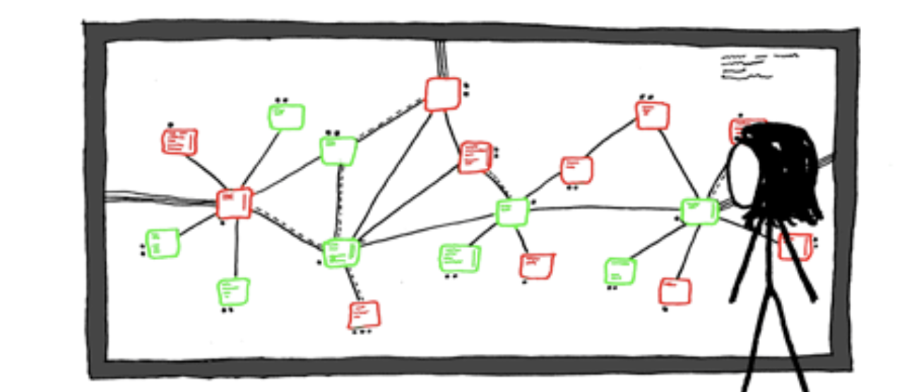

# Distributed Hash Tables (DHT) Application to Block Chain

## Introduction

A distributed hash table (DHT) is an [overlay network](https://www.wikiwand.com/en/Overlay_network) connected by virtual
or logical links in the underlying network. 

DHTs solve two main problems:

**Peer Discovery**

**Distributed Data Storage**

DHTs have been widely applied to blockchains

## Contents

- [Distributed Hash Tables (DHT) Application to Block Chain](#distributed-hash-tables--dht--application-to-block-chain)
  * [Introduction](#introduction)
  * [Contents](#contents)
  * [What kinds of problems do DHTs solve?](#what-kinds-of-problems-do-dhts-solve-)
  * [Comparison of DHT algorithms](#comparison-of-dht-algorithms)
    + [Chord](#chord)
    + [Kademlia](#kademlia)
    + [test](#test)
  * [DHTs in the wild](#dhts-in-the-wild)
  * [Attacks](#attacks)
    + [Join-Leave (Eclipse) attack](#join-leave--eclipse--attack)
    + [Sybil attack](#sybil-attack)
    + [Techniques for attack mitigation](#techniques-for-attack-mitigation)
      - [Cuckoo Rule](#cuckoo-rule)
  * [References](#references)
  * [Contributors](#contributors)
  * [Appendices](#appendices)
  
## Network Characterization

## Comparison of DHT algorithms

| Algorithm           | Lookups            | Store                |
| ------------------- | ----------------------------------------- |
| Chord               | $\mathbb O(log(n))$|                      |
| Kademlia            | Grin version       |                      |

### Chord

### Kademlia

$\alpha$

$\mathbb B$

$k$

**NodeID**

NodeIds are binary numbers chosen by each node on the network. The network design relies on node IDs being 
*uniformly distributed*. That is, selected by some random procedure.

**Node distance**

**$k$-buckets**

Organisation into k-buckets
http://xlattice.sourceforge.net/components/protocol/kademlia/specs.html

  $$ distance(x, y) = x \oplus y$$
  
The buckets are organized by the distance between the node and the contacts in the bucket.
Specifically, for bucket $j$, where $0 <= j < k$, we are guaranteed that

   $$ 2^j <= distance(node, contact) < 2^{(j+1)} $$
   
$k$ must be selected in such a way as to make it very unlikely in a large network that all contacts in a bucket
would have disappear in one hour. This probability calculation is biased towards long-lived contacts over more
recent contacts.

A $k$-bucket is characterized as follows:

- A node may have multiple bucket lists, each sorted by the time since they were last in contact.
- When an unknown node makes contact, the receiving node will try to add that node to one of it's buckets.
- If a bucket is full, the receiving node will attempt to ping the least recently contacted node.
- If that node is unavailable it is removed from the bucket and the new node is added.

**Protocol**

`PING` -
`STORE` -
`FIND_NODE` -
`FIND_VALUE` -

**Node lookup**

## DHTs in the wild

## DHT Protocols

### Join/Leave

### Store/

## Attacks

### Join-Leave (Eclipse) attack

### Sybil attack

### Techniques for attack mitigation

#### Cuckoo Rule

​	$ r \cdot G + v \cdot H ​$

## Competing overlay networks

## References

[[1]] *Confidential Transactions*. Maxwell, G. (2017)  Available at: https://people.xiph.org/~greg/confidential_values.txt (Accessed: 24 October 2018).

[1]: http://xlattice.sourceforge.net/components/protocol/kademlia/specs.html
"Original confidential transaction paper"

## Contributors

https://github.com/sdbondi

https://github.com/hansieodendaal

## Appendices

